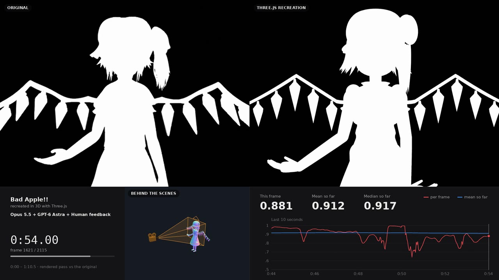
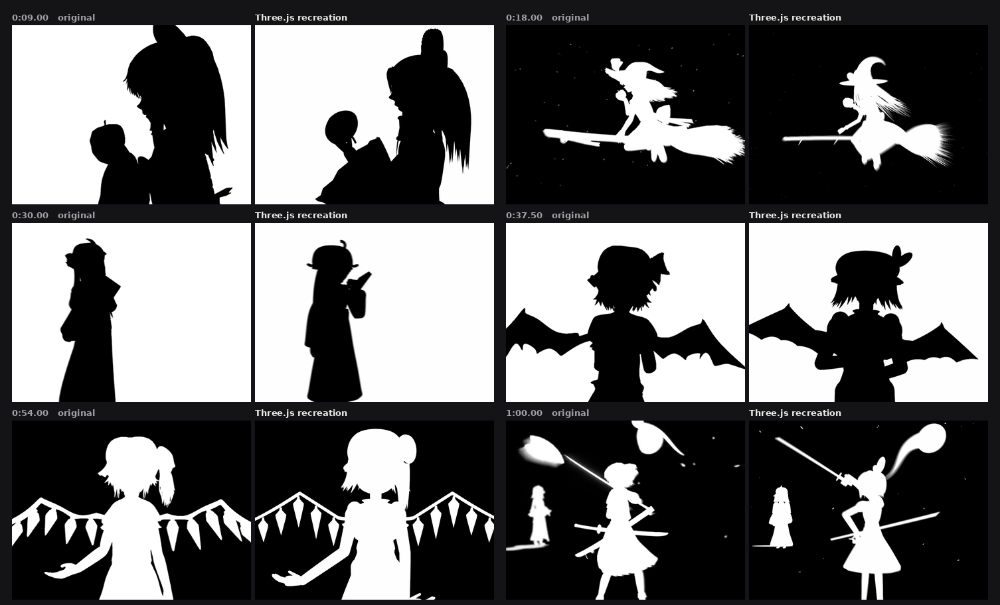
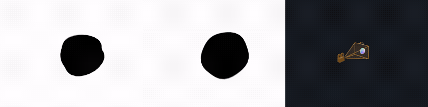
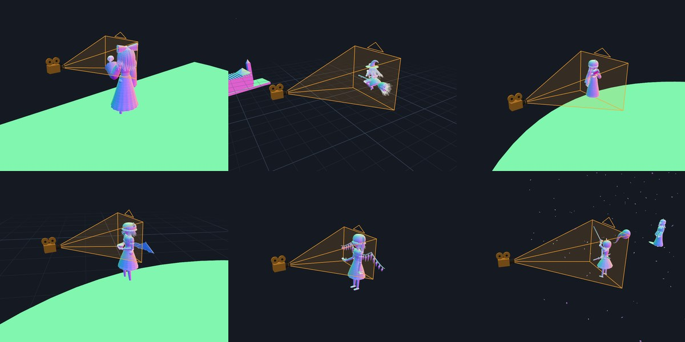
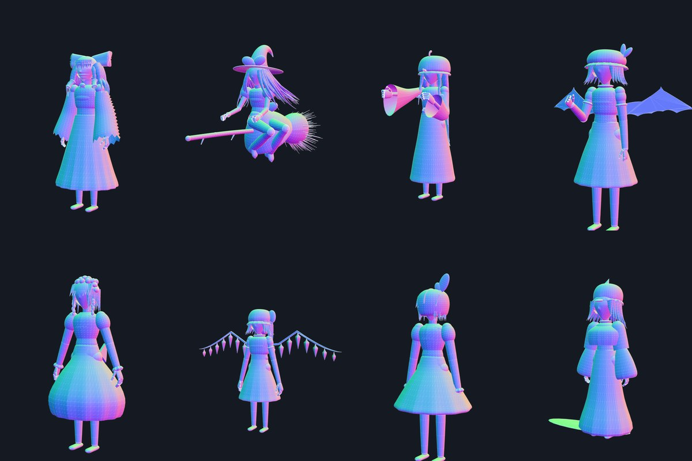

# Bad Apple!! in Three.js

The *Bad Apple!!* shadow-art music video, rebuilt in true 3D with Three.js. Every character, prop, camera move
and transition is modeled and animated from scratch: no video frames, no traced 2D shapes. The film is
rendered twice, once as the two-tone silhouette film and once as a behind-the-scenes view of the real
geometry, and every frame is scored against the original.

## Human note

I first wanted to do something with GPT-6 Astra entirely, but every time it completely missed what I wanted and constantly tried to cheat by making up 2D shapes, it just couldn't get it right.

So, I started from scratch with Opus 5.5, it succeeded surprisingly well, it immediately got what I was looking for, however I had to give few feedbacks because it often misinterpreted what the characters were doing. I didn't corrected every detail, but more the striking things only. So, you might say the experiment could be biased with human intervention instead of one-shotting it, but really, I didn't have to do that much.

It built very good methodology and tooling, it defined its scoring and measurement/comparison systems unprompted, however what it lacked really was vision, and that showed more and more around Remilia, it was hallucinating stuff.

That's when I brought GPT-6 Astra, something surprising is that it immediately one-shotted good portions with zero need for feedback (most striking example is 00:41-00:55), despite that it couldn't do something proper when starting from zero, but continuing on the existing work by Opus 5.5 turned it into a beast and it was also very good at figuring out transition, I'm impressed how well the Flandre-Youmu transition is done.

I tried again GPT-6 Astra alone and it still did terrible a job, so, this could only be achieved by both models working together...

Both had different views on the work and methods and thing to fix that was very interesting.
I did only a part because I wanted to publish this fast, maybe prompt the rest of the video soon.

I'm curious how future models will hold for a challenge like that, with no handholding ! I'm guessing it tackles mostly vision, but the ingenuity behind it is nice to appreciate too.
Maybe one day we will have 0.999 score on it ?

---

**Want to try it with your own agent?** The
[`from-scratch`](https://github.com/Ni-Cobra/Bad-Apple-ThreeJS/tree/from-scratch) branch has the same engine,
tools and scoring pipeline with an empty scene, compact docs and a kickoff prompt (`PROMPT.md`). Point your
agent at it and see how far it gets.

---



**0:00 – 1:10.5** is staged: 2115 frames, eight characters and about twenty transitions. Pixel agreement with
the original is **0.901 on average (median 0.907)**. Made by coding agents (GPT-6 Astra and Claude Opus 5.5),
steered by human review.

## Original vs recreation



## Behind the scenes

The same world at the same instant, seen by a witness camera: normal shading, a wireframe overlay, the film
camera with its view frustum, and the ground grid. Scenery drawn in the background color (Reimu's cliff,
Patchouli's terrace) is invisible in the film and shows up here.





## The cast

Reimu, Marisa, Patchouli, Remilia, Sakuya, Flandre, Youmu and Yuyuko: procedural, rigged models built from
lathes, lofts, strands and cloth strips, with IK arms, swept sleeves and wind-driven hair. Their proportions
were measured against frames of the original.



## How it works

- **Everything is a pure function of time.** There is no simulation state, so any frame renders on its own,
  motion blur samples exact sub-frame instants, and the same commit always renders the same pixels.
- **One world, one shot list.** [`src/shots/shots.js`](src/shots/shots.js) poses every actor, IK reach and
  camera at time `t`; [`src/shots/director.js`](src/shots/director.js) evaluates it. Transitions are continuous
  camera and actor moves inside that world, not cuts.
- **Silhouette renderer.** Unlit two-tone materials, and an accumulation pass averaging 10 to 32 jittered
  sub-frames per frame (motion blur and anti-aliasing), with the original's palette flips and wipe.
- **Measured against the original.** Screen paths, sizes and beats were measured on the original frame by
  frame. Camera keys were solved by a search that scores renders against it. Performances run on motion
  curves timed from full-rate contact sheets.
- **Headless pipeline.** Playwright drives Chromium, frames go straight into ffmpeg, and a Python composer
  builds the deliverable video with the original's soundtrack and a live score graph.

The full write-up is in [`docs/`](docs/README.md). It covers the storyboard, architecture, characters,
transitions and the agents' process, including the rejected attempts.

## Running it

You need Node 22, ffmpeg on `PATH` and Python 3.

```bash
npm install && npx playwright install chromium
python3 -m venv .venv && .venv/bin/pip install numpy pillow

# the original video (not in the repo): reference for comparisons, scoring and the soundtrack
.venv/bin/pip install yt-dlp
.venv/bin/yt-dlp -f 230+140 --merge-output-format mp4 -o bad_apple_original.mp4 https://www.youtube.com/watch?v=FtutLA63Cp8

# the deliverable: both passes rendered, scored and composed -> deliverable/bad_apple_3d.mp4
./make_video.sh "Your title"

# live preview in the browser
node tools/server.mjs 8080    # http://127.0.0.1:8080/?play  (?t=14.78&view=bts for one instant, ?lab=marisa for a turntable)
```

Rendering is on the CPU when headless Chromium has no GPU: a full pass takes several minutes. More commands
are in [CLAUDE.md](CLAUDE.md): stills, comparison strips, the camera solver, probes and motion checks.

## Layout

```
src/film.js            the one persistent world: actors, props, cameras, behind-the-scenes helpers
src/shots/             the shot list (shots.js) and the director that evaluates it
src/characters/        the humanoid rig and the eight characters
src/props/             apple, broom, castle, teacup, knife, katana, fan, cherry tree, petals...
src/core/              timeline (tracks, motion curves), accumulation renderer, materials, geometry helpers
tools/                 headless renderer, comparison and scoring tools, camera solver, probes, video composer
docs/                  storyboard, architecture, characters, transitions, process, status, handoff
make_video.sh          the whole deliverable in one command
```

## Branches

| Branch | What it is |
| --- | --- |
| [`gpt-6-astra_opus-5-5_recreation`](https://github.com/Ni-Cobra/Bad-Apple-ThreeJS/tree/gpt-6-astra_opus-5-5_recreation) | This recreation (0:00 – 1:10.5) |
| [`from-scratch`](https://github.com/Ni-Cobra/Bad-Apple-ThreeJS/tree/from-scratch) | The engine and tooling only: an empty scene and a kickoff prompt for your own attempt |

## License and credits

The code is under the [MIT license](LICENSE). *Bad Apple!!* is an arrangement by Alstroemeria Records
(feat. nomico) of a song from ZUN's Touhou Project; the shadow-art video it recreates is by Anira. The
characters belong to Team Shanghai Alice. The original video is not included in this repository.
